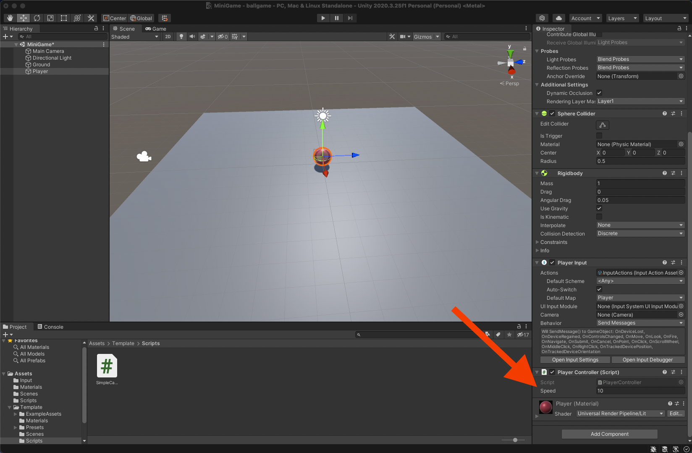
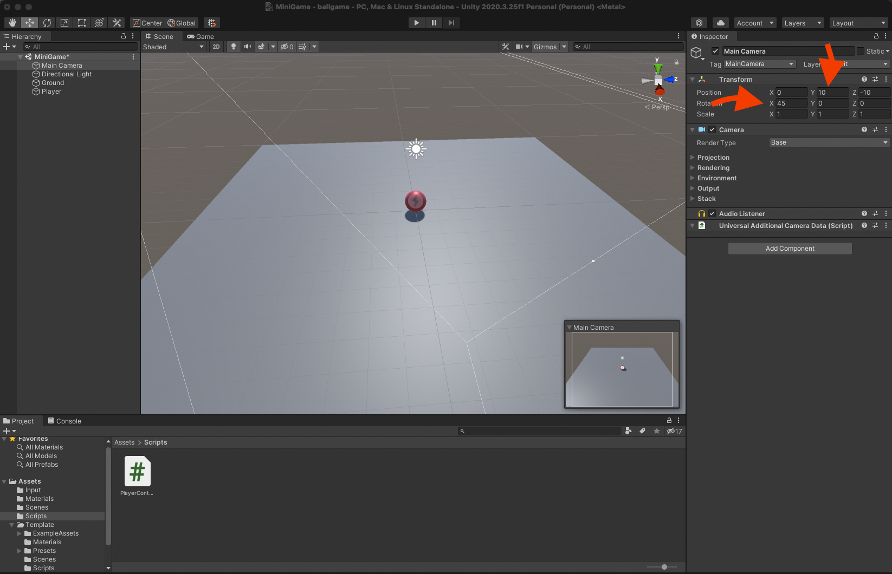
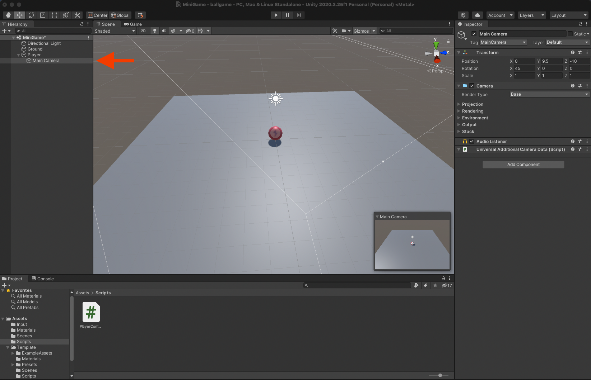
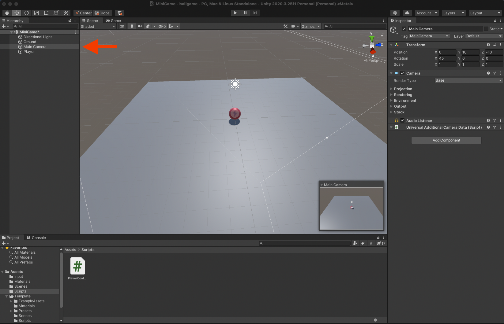

<h1 align="center">Roll a Ball</h1>
<p align="center">First Unity Tutorial Project</p>


<p align="center">Collect all the yellow rotating cubes rolling a ball</p>

## Steps to run the game from this repository
- [Download Unity here](https://unity.com/download)
- Clone the repository
- Open the project and click on the play button

<h1 align="center">Code your own project</h1>
<p align="center">Here starts a tutorial below to build your own rollaball game</p>

# 1. Setting up the Game
## Create your own Unity Project
- Select Universal Render Pipeline
- File -> New Scene
- New -> Folder -> "Template"
- Put everything in Assets folder (folders and Readme) in the Template folder

## Create a New Scene
- File -> Save As... -> New Folder "Scenes" ("MiniGame" - name of the scene)

## Create a primitive plane
- Menu (or Hierarchy) "Game Object" -> "3D Object" -> "Plane"
- Rename "Plane" to "Ground"
- Select the 3 dots on the "Transform" section on Inspector to Reset the coordinates of the Ground to the Origin Point of the world (0,0,0)
- Re-Scale your Ground

## Create a Player GameObject
- Create the Sphere at 3D Object -> Sphere
- Rename the Sphere to "Player"
- Reset the position to the Origin Point (0,0,0)
- Set the Y position of the Player to not be buried into the Ground

## Adjust the default lighting
- Select the "Directional Light" on Hierarchy and change the color to pure white

## Add Colors with Materials
- Select to create a New Folder in Assets named "Materials"
- Create "Material" inside "Materials" folder
- Rename the Material to "Background"
- Change the Background Material color Base Map
- Change the Metallic Map and the Smoothness
- Drag the Background Material to the Ground on the scene
- Do the same for the Player
- Change the Directional Light Rotation to (50,50,0)

# 2. Moving the Player
## Add a Rigidbody to the Player
- In the Hierarchy select the Player GameObject
- In the Inspector select Add Component and search and select "Rigidbody"

## Install the Input System package to apply forces and move the Player
-  To install the Input System package, into top menu go to "Window" and "Package Manager"
- Select "Packages" tab and select "Unity Registry"
- Find Input System, then select Install to add the Package to your project
- You might see a Warning shows up, select "Yes" to enable the native platform backends for the Unity Input System and Select "Save" your changes to the Scene

Now you're able to use the keyboard inputs!

**If you are making this game for Windows**
## One more step
- In the top menu, go to "File", "Build Settings"
- Change the Architecture to x86_64
- Close the "Build Settings"
**You'll find more about this when you finish your game**

## Add a Player Input component to the sphere
- In the Hierarchy, select the "Player" GameObject
- In the Inspector, select "Add Component", then search for and add "Player Input"
- Go to the Inspector window, in the "Player Input" component, select "Create Actions" and create a new folder called "Input" inside "Assets" folder. Name "InputActions" and save inside "Input" folder that you just created

## Create a new script
- In the "Project" window, click on the Create menu and choose "Folder", rename it as "Scripts"
- Select the "Player" GameObject in the Hierarchy and then use the Add Component button in the Inspector. Search and select "New script" (that way you create and attach a new script in one step)
- Name the new script as "PlayerController"
- Select "Create and Add" or press the Enter key
- Move the file "PlayerController" created into the "Assets" folder to the "Scripts" folder in the Project window
- Select the file "PlayerController" and in the Inspector select "Open"

## Write the OnMove function declaration
- You don't need the Update() function for now, so you can remove it
- Update() is called before rendering a frame, and this is where most of your code will go
- FixedUpdate(), on the other hand, is called just before performing any physics calculations, and this is where your physics code will go
- Add a new line below the first three namespaces (below the line "using UnityEngine;"), write "using UnityEngine.InputSystem;"
- The PlayerInput component will notify the PlayerController script of action happening by calling functions with pre-defined names within your scripts
- You need to be notified whenever the move action happens. The predefined function for the changes in movement controls when pressing WASD or moving the joystick (or the keyboard's arrows) is called OnMove, and you can find it selecting "Player" GameObject in the Hierarchy and visualizing in the Inspector "Player Input" section the functions avaiable
- The computer will read the information of the key pressed and then use that information to move the ball using code in the Update function which you'll write later
- Write into the script code, right after the function Start, the function:
```C#
void OnMove(InputValue movementValue)
{

}
```

## Apply input data to the Player
- Let's use the method Get to get the movement input data from the sphere and store it's a Vector2 variable:
```C#
void OnMove(InputValue movementValue)
{
    Vector2 movementVector = movementValue.Get<Vector2>();
}
```
- The "Player" GameObject uses a Rigidbody and interacts with a physics engine.
- Next, you need to use the variable you just created to add or apply forces to the Rigidbody and move the "Player" GameObject in the scene
- To do this, your PlayerController script will need to access the Rigidbody component and add force to the "Player" GameObject
- First let's create a variable to hold the reference in the script:

```C#
public class PlayerController : MonoBehaviour
{

    private Rigidbody rb; // hold the reference in the script

    // Start is called before the first frame update
    void Start()
    {

    }

    void OnMove(InputValue movementValue)
    {
        Vector2 movementVector = movementValue.Get<Vector2>();
    }
}
```

- The variable is private and not public because you don't need this variable to be accessible from the Inspector or from the other Scripts right now
- Next, inside the Start function, write:

```C#
public class PlayerController : MonoBehaviour
{

    private Rigidbody rb; // hold the reference in the script

    // Start is called before the first frame update
    void Start()
    {
        rb = GetComponent<Rigidbody>();
    }

    void OnMove(InputValue movementValue)
    {
        Vector2 movementVector = movementValue.Get<Vector2>();
    }
}
```

- This sets the value of the variable "rb" by getting a reference to the Rigidbody component, attached to the Player sphere GameObject
- All of the code in the Start function is called on the first frame that the script is active. This is often the very first frame of the game. So the player will be able to move the sphere straight away
- Now you need to set up the FixedUpdate function, so you can call force on the RigidBody stored in the variable "rb":

```C#
public class PlayerController : MonoBehaviour
{

    private Rigidbody rb; // hold the reference in the script

    // Start is called before the first frame update
    void Start()
    {
        rb = GetComponent<Rigidbody>();
    }

    void OnMove(InputValue movementValue)
    {
        Vector2 movementVector = movementValue.Get<Vector2>();
    }

    void FixedUpdate()
    {
        
    }
}
```

## Apply force to the Player
- Next, let's start to write the code for adding force.
- In the function body, add the code:
```C#
void FixedUpdate()
    {
        rb.AddForce(movementVector);
    }
```

- You'll probably see in your script editor that there is an error on this line. There are two reasons for this.
- Firstly, the variable you are trying to use is a Vector2 and you need to give this method a vector3 variable. 
- Vector3 variables store data across three axes, x, y, and z. These values will determine the direction of the force you add to the ball. If you head back to the editor and look at the global gizmo, you can see the arrows also indicate this. 
- To resolve this issue, you need to create two new variables for the individual input directions. Underneath the Rigidbody variable you created, add two more variables called movementX and movementY:
```C#
private Rigidbody rb;
private float movementX;
private float movementY;
```

- These should be private like the previous variable, float type, which is short for floating point or decimal point value. These give you more precision than a whole number or integer value. You can then reference these values inside of OnMove and assign these values of movement vectors X and Y. 
In OnMove, add the following two lines of code:
```C#
void OnMove(InputValue movementValue)
    {
        Vector2 movementVector = movementValue.Get<Vector2>();

        movementX = movementVector.x;
        movementY = movementVector.y;
    }
```

- The second reason you were getting an error is because the movement vector variable was created inside of OnMove. That means it's what's called nonexistent in the current context, as it was inside another method. 
- To fix this, you can combine the movement floats you just created inside of FixedUpdate to create a vector3 variable. This will take zero as the y value because the ball needs to move along the x and z axis in 3D space. 
- In the FixedUpdate function, add a new line at the top of the function and write:
```C#
void FixedUpdate()
    {
        Vector3 movement = new Vector3(movementX, 0.0f, movementY);

        rb.AddForce(movementVector);
    }
```

- The f after the value signifies that this is a float value. 
- Next, use the new Vector3 variable, movement, to Add Force to the Rigidbody of the player sphere. Revise the second line of code in FixedUpdate to:
```C#
void FixedUpdate()
    {
        Vector3 movement = new Vector3(movementX, 0.0f, movementY);

        rb.AddForce(movement);
    }
```

- Let's save the script and then return to the Unity editor to give it a try. Use the Play button to enter play mode and test. 
- It works! But the player is moving really slowly. 
- Leave Play mode to stop testing. 

## Fix the Player movement speed
- Okay, you've almost finished setting up the player movement, but the speed isn't quite right. Let's go back to your script editor to fix that. 
- First, let's add a speed variable to the script, so that you can control the player movement from inside the Inspector. 
- Go to the start of the script, where you have declared other variables. Add a public float variable called "speed", to the start of the script with a starting value of zero. To do this, write:
```C#
using System.Collections;
using System.Collections.Generic;
using UnityEngine;
using UnityEngine.InputSystem;

public class PlayerController : MonoBehaviour
{
    public float speed = 0;

    private Rigidbody rb;

    private float movementX;
    private float movementY;

    // Start is called before the first frame update
    void Start()
    {
        rb = GetComponent<Rigidbody>();
    }

    void OnMove(InputValue movementValue)
    {
        Vector2 movementVector = movementValue.Get<Vector2>();

        movementX = movementVector.x;
        movementY = movementVector.y;
    }

    void FixedUpdate()
    {
        Vector3 movement = new Vector3(movementX, 0.0f, movementY);

        rb.AddForce(movement);
    }
}
```

- Next, back in FixedUpdate, multiply the force you are adding to the sphere's Rigidbody, by this strength variable. To do this, revise your line of code to:
```C#
void FixedUpdate()
{
    Vector3 movement = new Vector3(movementX, 0.0f, movementY);

    rb.AddForce(movement * speed);
}
```

- Then save your script, and return to the editor. 
- Because you made the speed variable public, you can find it in the Inspector on the Player Controller script component. 
- Let's try changing the variable's value to ten, to see if the speed is fast enough to improve the player experience:


<p align="center">Set the speed to 10 in the Inspector</p>

- Enter play mode, and test the revised movement. 
- Great. This looks like a good speed for the player, and the value is now exposed, so you can adjust it easily from the Unity editor if you need to. 
- Exit play mode, and then save your changes to the scene. 
- Congratulations. The player can now move the sphere. 

# 3. Moving the Camera
## Set the Camera position
- So right now, the camera doesn't move and from its current position can't see a lot. To change this, you need to tie the camera to the player GameObject. 
- First, set the position of the camera. Lift it up by 10 units, tilt it down by 45 degrees:


<p align="center">Third person camera position setup</p>

- This is a typical third person setup with the camera as a child of the player GameObject:


<p align="center">Camera as a a child of the Player</p>

- This works well for a lot of games because the camera GameObject will inherit the transform changes of the player GameObject. When the player moves in the game, the camera will move with them. 
- However, for this game, that setup creates a problem. When the player rotates, the camera rotates as well. Because the ball is rolling, the camera is also going to inherit this motion. Let's look at this in play mode. 
- Hold down the up arrow to move. The camera is a child of the player sphere so even though the camera is not moving at all relative to the player's game object, you can see that the player game object is rotating wildly and the camera's point of view rotates with it. 
- Okay, let's exit play mode. 
- Let's think about how to resolve this. The player GameObject in your game, a sphere, is rotating on all three axes, not just one.
- In a more typical third person game camera setup, the camera as a child of the player GameObject will always be in the position relative to its immediate parent. This position will be the parent's position in the game modified or offset by any value in the child's transform. In this game, that approach won't work so let's detach the camera:


<p align="center">Camera detached as a a child of the Player</p>

- The new offset value will be the difference between the player game object and the camera. 
- To do this, you need to associate the camera with the player GameObject with a script rather than as a child of the GameObject.

## Built With
- Unity
- Visual Studio
- C#

## Future Updates
- [x] ~~Include "Setting up the Game" section~~
- [x] ~~Include "Moving the Player" section~~
- [ ] Include "Moving the Camera" section - ***in progress***
- [ ] Include "Setting up the Play Area" section
- [ ] Include "Creating Collectibles" section
- [ ] Include "Detecting Collisions with Collectibles" section
- [ ] Include "Displaying Score and Text" section
- [ ] Include "Building the Game" section
- [ ] Update "Setting up the Game" sub-section with video transcript
- [ ] Update "Moving the Player" section before "Apply force to the Player" sub-section with video transcript

## Author
**Matheus Magnusson**
[Profile](https://github.com/mathmagson "Matheus Magnusson")

## Credits
**Unity Learn Platform**
[Website](https://learn.unity.com "Unity Learn Platform")

## 🤝 Support
Contributions, issues, and feature requests are welcome!

Give a ⭐️ if you like this project!