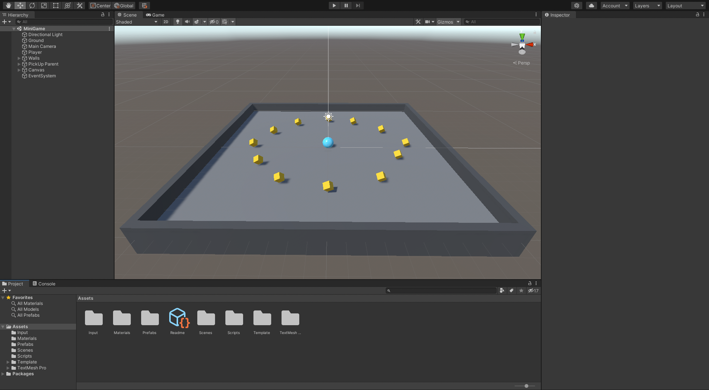

<h1 align="center">Roll a Ball</h1>

First Unity Tutorial Project

<h1>First Steps</h1>
- [Download Unity here](https://unity.com/download)
- Clone the repository
- Open the project and click on the play button

<h1 align="center">Tutorial</h1>

First Steps to Create your own Unity Project

- Select Universal Render Pipeline
- File -> New Scene
- New -> Folder -> "Template"
- Put everything in Assets folder (folders and Readme) in the Template folder
- File -> Save As... -> New Folder "Scenes" ("MiniGame" - name of the scene)
- Menu (or Hierarchy) "Game Object" -> "3D Object" -> "Plane"
- Rename "Plane" to "Ground"
- Select the 3 dots on the "Transform" section on Inspector to Reset the coordinates of the Ground to the Origin Point of the world (0,0,0)
- Re-Scale your Ground
- Create the Sphere at 3D Object -> Sphere
- Rename the Sphere to "Player"
- Reset the position to the Origin Point (0,0,0)
- Set the Y position of the Player to not be buried into the Ground
- Select the "Directional Light" on Hierarchy and change the color to pure white

Adding Colors

- Select to create a New Folder in Assets named "Materials"
- Create "Material" inside "Materials" folder
- Rename the Material to "Background"
- Change the Background Material color Base Map
- Change the Metallic Map and the Smoothness
- Drag the Background Material to the Ground on the scene
- Do the same for the Player
- Change the Directional Light Rotation to (50,50,0)
