<h1 align="center">Roll a Ball</h1>
<p align="center">First Unity Tutorial Project</p>

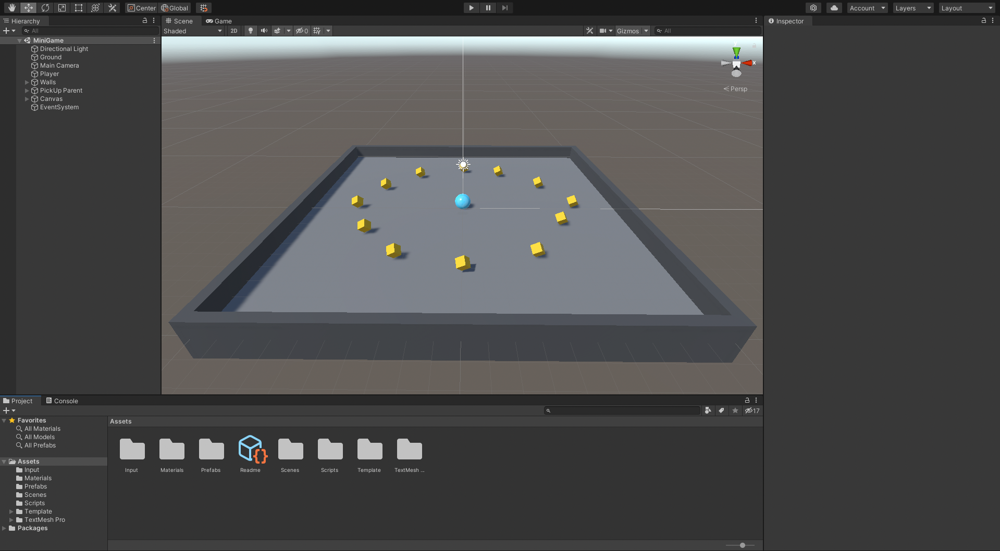
<p align="center">Collect all the yellow rotating cubes rolling a ball</p>

## Steps to run the game from this repository
- [Download Unity here](https://unity.com/download)
- Clone the repository
- Open the project and click on the play button

<h1 align="center">Code your own project</h1>
<p align="center">Here starts a tutorial below to build your own rollaball game</p>

# 1. Setting up the Game
## Create your own Unity Project
- Select Universal Render Pipeline
- File -> New Scene
- New -> Folder -> "Template"
- Put everything in Assets folder (folders and Readme) in the Template folder

## Create a New Scene
- File -> Save As... -> New Folder "Scenes" ("MiniGame" - name of the scene)

## Create a primitive plane
- Menu (or Hierarchy) "Game Object" -> "3D Object" -> "Plane"
- Rename "Plane" to "Ground"
- Select the 3 dots on the "Transform" section on Inspector to Reset the coordinates of the Ground to the Origin Point of the world (0,0,0)
- Re-Scale your Ground

## Create a Player GameObject
- Create the Sphere at 3D Object -> Sphere
- Rename the Sphere to "Player"
- Reset the position to the Origin Point (0,0,0)
- Set the Y position of the Player to not be buried into the Ground

## Adjust the default lighting
- Select the "Directional Light" on Hierarchy and change the color to pure white

## Add Colors with Materials
- Select to create a New Folder in Assets named "Materials"
- Create "Material" inside "Materials" folder
- Rename the Material to "Background"
- Change the Background Material color Base Map
- Change the Metallic Map and the Smoothness
- Drag the Background Material to the Ground on the scene
- Do the same for the Player
- Change the Directional Light Rotation to (50,50,0)

# 2. Moving the Player
## Add a Rigidbody to the Player
- In the Hierarchy select the Player GameObject
- In the Inspector select Add Component and search and select "Rigidbody"

## Install the Input System package to apply forces and move the Player
-  To install the Input System package, into top menu go to "Window" and "Package Manager"
- Select "Packages" tab and select "Unity Registry"
- Find Input System, then select Install to add the Package to your project
- You might see a Warning shows up, select "Yes" to enable the native platform backends for the Unity Input System and Select "Save" your changes to the Scene

Now you're able to use the keyboard inputs!

**If you are making this game for Windows**
## One more step
- In the top menu, go to "File", "Build Settings"
- Change the Architecture to x86_64
- Close the "Build Settings"
**You'll find more about this when you finish your game**

## Add a Player Input component to the sphere
- In the Hierarchy, select the "Player" GameObject
- In the Inspector, select "Add Component", then search for and add "Player Input"
- Go to the Inspector window, in the "Player Input" component, select "Create Actions" and create a new folder called "Input" inside "Assets" folder. Name "InputActions" and save inside "Input" folder that you just created

## Create a new script
- In the "Project" window, click on the Create menu and choose "Folder", rename it as "Scripts"
- Select the "Player" GameObject in the Hierarchy and then use the Add Component button in the Inspector. Search and select "New script" (that way you create and attach a new script in one step)
- Name the new script as "PlayerController"
- Select "Create and Add" or press the Enter key
- Move the file "PlayerController" created into the "Assets" folder to the "Scripts" folder in the Project window
- Select the file "PlayerController" and in the Inspector select "Open"

## Write the OnMove function declaration
- You don't need the Update() function for now, so you can remove it
- Update() is called before rendering a frame, and this is where most of your code will go
- FixedUpdate(), on the other hand, is called just before performing any physics calculations, and this is where your physics code will go
- Add a new line below the first three namespaces (below the line "using UnityEngine;"), write "using UnityEngine.InputSystem;"
- The PlayerInput component will notify the PlayerController script of action happening by calling functions with pre-defined names within your scripts
- You need to be notified whenever the move action happens. The predefined function for the changes in movement controls when pressing WASD or moving the joystick (or the keyboard's arrows) is called OnMove, and you can find it selecting "Player" GameObject in the Hierarchy and visualizing in the Inspector "Player Input" section the functions avaiable
- The computer will read the information of the key pressed and then use that information to move the ball using code in the Update function which you'll write later
- Write into the script code, right after the function Start, the function:
```C#
void OnMove(InputValue movementValue)
{

}
```

## Apply input data to the Player
- Let's use the method Get to get the movement input data from the sphere and store it's a Vector2 variable:
```C#
void OnMove(InputValue movementValue)
{
    Vector2 movementVector = movementValue.Get<Vector2>();
}
```
- The "Player" GameObject uses a Rigidbody and interacts with a physics engine.
- Next, you need to use the variable you just created to add or apply forces to the Rigidbody and move the "Player" GameObject in the scene
- To do this, your PlayerController script will need to access the Rigidbody component and add force to the "Player" GameObject
- First let's create a variable to hold the reference in the script:

```C#
public class PlayerController : MonoBehaviour
{

    private Rigidbody rb; // hold the reference in the script

    // Start is called before the first frame update
    void Start()
    {

    }

    void OnMove(InputValue movementValue)
    {
        Vector2 movementVector = movementValue.Get<Vector2>();
    }
}
```

- The variable is private and not public because you don't need this variable to be accessible from the Inspector or from the other Scripts right now
- Next, inside the Start function, write:

```C#
public class PlayerController : MonoBehaviour
{

    private Rigidbody rb; // hold the reference in the script

    // Start is called before the first frame update
    void Start()
    {
        rb = GetComponent<Rigidbody>();
    }

    void OnMove(InputValue movementValue)
    {
        Vector2 movementVector = movementValue.Get<Vector2>();
    }
}
```

- This sets the value of the variable "rb" by getting a reference to the Rigidbody component, attached to the Player sphere GameObject
- All of the code in the Start function is called on the first frame that the script is active. This is often the very first frame of the game. So the player will be able to move the sphere straight away
- Now you need to set up the FixedUpdate function, so you can call force on the RigidBody stored in the variable "rb":

```C#
public class PlayerController : MonoBehaviour
{

    private Rigidbody rb; // hold the reference in the script

    // Start is called before the first frame update
    void Start()
    {
        rb = GetComponent<Rigidbody>();
    }

    void OnMove(InputValue movementValue)
    {
        Vector2 movementVector = movementValue.Get<Vector2>();
    }

    void FixedUpdate()
    {
        
    }
}
```

## Apply force to the Player
- Next, let's start to write the code for adding force.
- In the function body, add the code:
```C#
void FixedUpdate()
    {
        rb.AddForce(movementVector);
    }
```

- You'll probably see in your script editor that there is an error on this line. There are two reasons for this.
- Firstly, the variable you are trying to use is a Vector2 and you need to give this method a vector3 variable. 
- Vector3 variables store data across three axes, x, y, and z. These values will determine the direction of the force you add to the ball. If you head back to the editor and look at the global gizmo, you can see the arrows also indicate this. 
- To resolve this issue, you need to create two new variables for the individual input directions. Underneath the Rigidbody variable you created, add two more variables called movementX and movementY:
```C#
private Rigidbody rb;
private float movementX;
private float movementY;
```

- These should be private like the previous variable, float type, which is short for floating point or decimal point value. These give you more precision than a whole number or integer value. You can then reference these values inside of OnMove and assign these values of movement vectors X and Y. 
In OnMove, add the following two lines of code:
```C#
void OnMove(InputValue movementValue)
    {
        Vector2 movementVector = movementValue.Get<Vector2>();

        movementX = movementVector.x;
        movementY = movementVector.y;
    }
```

- The second reason you were getting an error is because the movement vector variable was created inside of OnMove. That means it's what's called nonexistent in the current context, as it was inside another method. 
- To fix this, you can combine the movement floats you just created inside of FixedUpdate to create a vector3 variable. This will take zero as the y value because the ball needs to move along the x and z axis in 3D space. 
- In the FixedUpdate function, add a new line at the top of the function and write:
```C#
void FixedUpdate()
    {
        Vector3 movement = new Vector3(movementX, 0.0f, movementY);

        rb.AddForce(movementVector);
    }
```

- The f after the value signifies that this is a float value. 
- Next, use the new Vector3 variable, movement, to Add Force to the Rigidbody of the player sphere. Revise the second line of code in FixedUpdate to:
```C#
void FixedUpdate()
    {
        Vector3 movement = new Vector3(movementX, 0.0f, movementY);

        rb.AddForce(movement);
    }
```

- Let's save the script and then return to the Unity editor to give it a try. Use the Play button to enter play mode and test. 
- It works! But the player is moving really slowly. 
- Leave Play mode to stop testing. 

## Fix the Player movement speed
- Okay, you've almost finished setting up the player movement, but the speed isn't quite right. Let's go back to your script editor to fix that. 
- First, let's add a speed variable to the script, so that you can control the player movement from inside the Inspector. 
- Go to the start of the script, where you have declared other variables. Add a public float variable called "speed", to the start of the script with a starting value of zero. To do this, write:
```C#
using System.Collections;
using System.Collections.Generic;
using UnityEngine;
using UnityEngine.InputSystem;

public class PlayerController : MonoBehaviour
{
    public float speed = 0;

    private Rigidbody rb;

    private float movementX;
    private float movementY;

    // Start is called before the first frame update
    void Start()
    {
        rb = GetComponent<Rigidbody>();
    }

    void OnMove(InputValue movementValue)
    {
        Vector2 movementVector = movementValue.Get<Vector2>();

        movementX = movementVector.x;
        movementY = movementVector.y;
    }

    void FixedUpdate()
    {
        Vector3 movement = new Vector3(movementX, 0.0f, movementY);

        rb.AddForce(movement);
    }
}
```

- Next, back in FixedUpdate, multiply the force you are adding to the sphere's Rigidbody, by this strength variable. To do this, revise your line of code to:
```C#
void FixedUpdate()
{
    Vector3 movement = new Vector3(movementX, 0.0f, movementY);

    rb.AddForce(movement * speed);
}
```

- Then save your script, and return to the editor. 
- Because you made the speed variable public, you can find it in the Inspector on the Player Controller script component. 
- Let's try changing the variable's value to ten, to see if the speed is fast enough to improve the player experience:

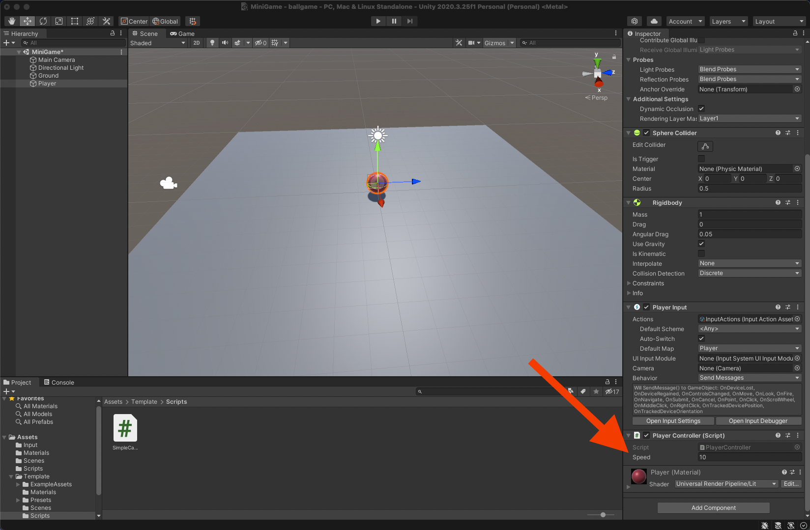
<p align="center">Set the speed to 10 in the Inspector</p>

- Enter play mode, and test the revised movement. 
- Great. This looks like a good speed for the player, and the value is now exposed, so you can adjust it easily from the Unity editor if you need to. 
- Exit play mode, and then save your changes to the scene. 
- Congratulations. The player can now move the sphere. 

# 3. Moving the Camera
## Set the Camera position
- So right now, the camera doesn't move and from its current position can't see a lot. To change this, you need to tie the camera to the player GameObject. 
- First, set the position of the camera. Lift it up by 10 units, tilt it down by 45 degrees:

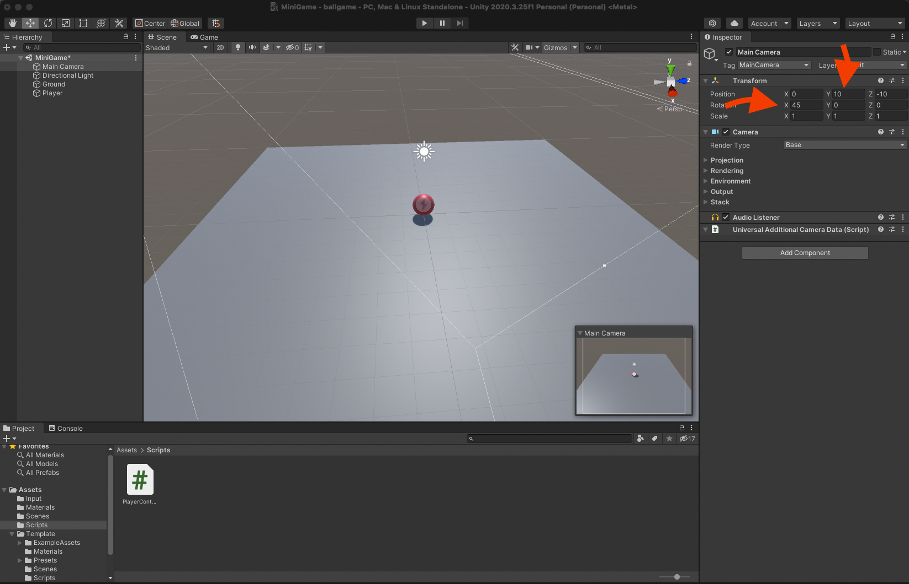
<p align="center">Third person camera position setup</p>

- This is a typical third person setup with the camera as a child of the player GameObject:

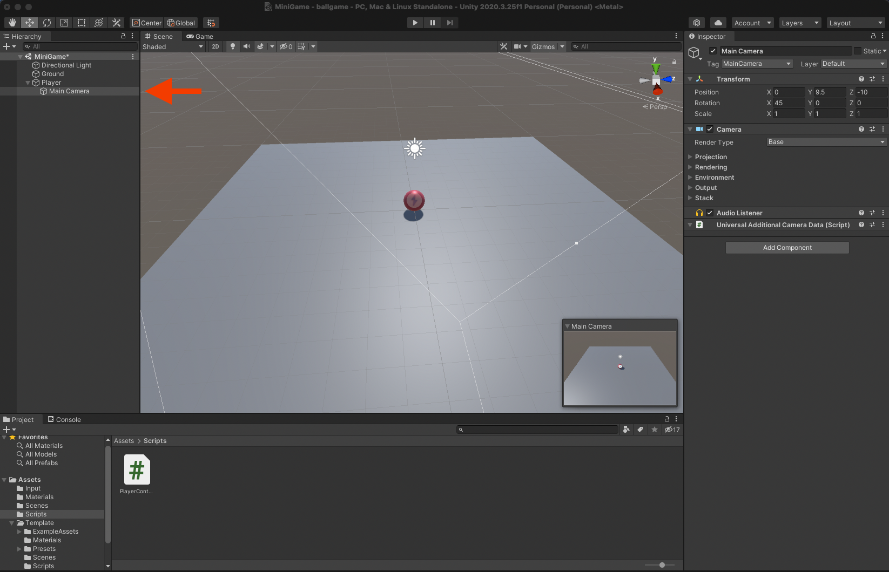
<p align="center">Camera as a a child of the Player</p>

- This works well for a lot of games because the camera GameObject will inherit the transform changes of the player GameObject. When the player moves in the game, the camera will move with them. 
- However, for this game, that setup creates a problem. When the player rotates, the camera rotates as well. Because the ball is rolling, the camera is also going to inherit this motion. Let's look at this in play mode. 
- Hold down the up arrow to move. The camera is a child of the player sphere so even though the camera is not moving at all relative to the player's game object, you can see that the player game object is rotating wildly and the camera's point of view rotates with it. 
- Okay, let's exit play mode. 
- Let's think about how to resolve this. The player GameObject in your game, a sphere, is rotating on all three axes, not just one.
- In a more typical third person game camera setup, the camera as a child of the player GameObject will always be in the position relative to its immediate parent. This position will be the parent's position in the game modified or offset by any value in the child's transform. In this game, that approach won't work so let's detach the camera:

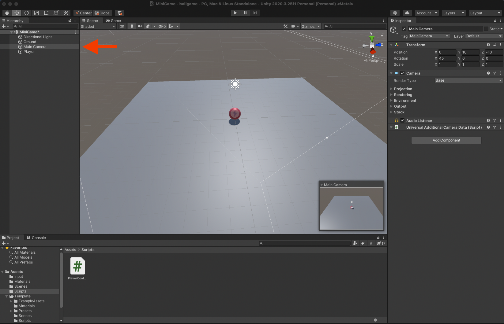
<p align="center">Camera detached as a a child of the Player</p>

- The new offset value will be the difference between the player game object and the camera. 
- To do this, you need to associate the camera with the player GameObject with a script rather than as a child of the GameObject.

## Write a CameraController script
- Okay, let's start by creating the new script to control the camera. With the Main Camera GameObject selected in the Hierarchy, select Add Component In the Inspector. 
- Call your new script, CameraController. 
- If you use the Inspector to create the script, it will be placed in the root or top level of the project folders. 
- Move it to your scripts Folder. 
- Open the new script for editing. 
- This script needs two variables, a public GameObject reference to the player GameObject and a private Vector3 variable to hold the offset value. 
- Inside the first curly brace, add the following line:
```C#
public class CameraController : MonoBehaviour
{
    public GameObject player;

    // Start is called before the first frame update
    void Start()
    {
        
    }

    // Update is called once per frame
    void Update()
    {
        
    }
}
```

- This will reference the player GameObject's position. 
- On a new line underneath, add another variable declaration:
```C#
public class CameraController : MonoBehaviour
{
    public GameObject player;

    private Vector3 offset;

    // Start is called before the first frame update
    void Start()
    {
        
    }

    // Update is called once per frame
    void Update()
    {
        
    }
}
```

- This will store the offset value. 
- The offset value variable is private because you're going to set the value in the script. 
- Now that you've declared the variable, let's calculate it. To do this, you're going to take the current transform position of the camera GameObject and subtract the transform position of the player GameObject to find the difference between the two. The Start function is the best place for this code. It needs to be calculated immediately when the game starts, but it only needs to be calculated once. 
- In the Start function, on a new line, after the first curly brace, let's write the equation like this:
```C#
// Start is called before the first frame update
void Start()
{
    offset = transform.position - player.transform.position;
}
```

- This will set offset equal to the camera transform position minus the player GameObjects transform position. 
- Next, you're going to use that to set the camera GameObjects transform position. This needs to happen in every frame. So the best place for that code is the Update function. 
- Inside the first curly brace, write:
```C#
// Update is called once per frame
void Update()
{
    transform.position = player.transform.position + offset;
}
```

- Now when a player moves the sphere with controls on the keyboard, the frame before displaying the camera, the camera GameObject is moved into a new position, aligned with the player GameObject before the frame is displayed. 
- This is just like what would happen if it were a child of that object, except it's only matching the position and not the rotation of the sphere. 
- However, Update is not actually the best place for this code. 
- It is true that Update runs every frame and in Update, each frame, you can track the position of the player GameObject and set the position of the camera. 
- However, you don't control which order all of the Update functions happen. 
- That means that the Update could run before other scripts or Unity systems that will change the player position, like the physics system. 
- So, what's the solution? 
- Well, for follow cameras and tasks, like gathering last known states, it's best to use Late Update. 
- Late Update runs every frame just like Update, but will run after all of the other updates are done. 
- Add Late in front of the Update method to change this:
// Update is called once per frame
```C#
void LateUpdate()
{
    transform.position = player.transform.position + offset;
}
```

- Okay, brilliant. 
- Now, you know that the camera position won't be set until the player has moved for that frame. 
- Let's save the script and return to Unity to test it out.

## Reference the Player GameObject
- There's one thing that you need to do before testing your changes. Create a reference to the Player GameObject. 
- To do that, drag the Player GameObject from the Hierarchy into the player slot in the camera controller component:

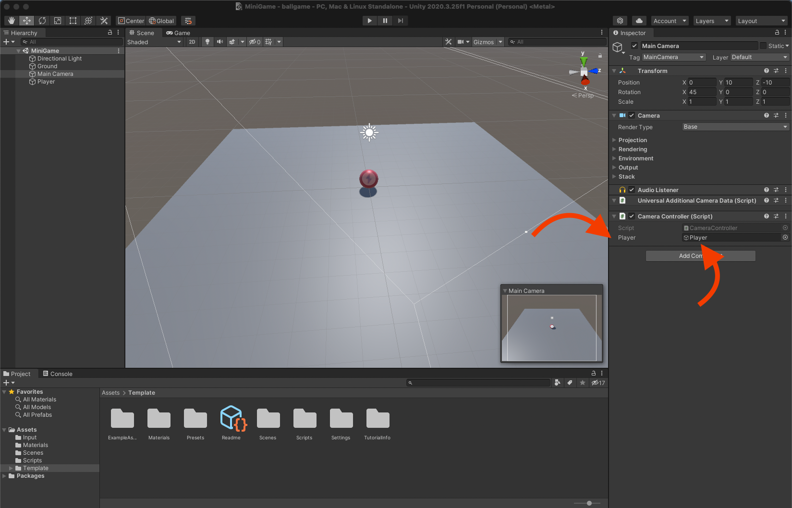
<p align="center">Reference to the Player GameObject in Main Camera Controller Script</p>

- Now enter play mode to test what you've done. 
- The camera follows the rolling ball without rotating even as the ball goes over the edge. 
- Excellent. 
- Remember to exit play mode when you finish testing and save your Unity project. 
- Now that you've set up the camera, in the next section of this project, you'll configure the basic play area for the game.

# 4. Setting up the Play Area
## Create a wall for the play field
- Okay, let's set up the play field.
- The play field for your game will be very simple. You will place walls around the edges to keep the player GameObject from falling off. And you'll create and place a set of collectible objects for the player to pick up. 
- First, let's get organized. 
- In the Hierarchy, create a new empty GameObject, reset its transform, and then rename it Walls. This will be the parent GameObject for all of the wall GameObjects. 
- Now you can build some walls. 
- Let's start by creating a new cube to be the first wall. 
- In the Hierarchy, select Create > 3D Object > Cube. Rename the cube GameObject, West Wall. In the Inspector, right click the Transform component title and select Reset. This resets the component to its default values. 
- Now drag the West Wall GameObject onto the Walls GameObject and release. This makes West Wall the child of Walls. 
- Let's focus the scene view camera to the West Wall object. To do this, press the F key while the cursor is over the scene view, or select Edit > Frame Selected. 
- Next, you need to change the size of the cube to fit one side of the play area. 
- In the Inspector, change the cube's Transform scale x value to 0.5, y value to 2, and z value to 20.5. 
- You can push the wall into place using the Translate tool, or you could enter a transform position value in the Inspector. 
- Let's use the Inspector. 
- Set the transform's position x value to minus 10. This places the wall neatly to the edge of the play area. 
- Now just one more thing. 
- Let's create a new material to change the color of the wall. 
- In the Project window, go to the Materials folder and select Create > Material. 
- Rename this new material Walls. 
- In the Inspector, select the base map's color field to open a color picker. 
- Set the RGB values to 79, 79, and 79. Next, set the metallic to zero and change the smoothness to 0.25 from matte finish. Then, drag the material from the Project window onto West Wall in the scene view. 
- Great, now you've done one wall.

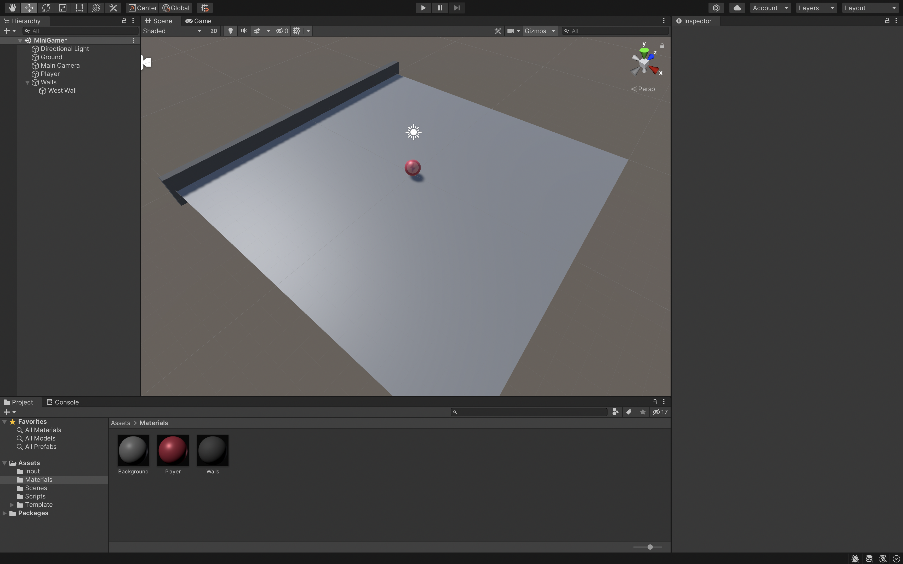
<p align="center">This is how your wall look like</p>

## Finish the play field walls
- To create the next wall, you could start with another new cube, but then you'd have to rescale the new cube before placing it. 
- Your first wall is already a perfect size. 
- Right-click the West Wall GameObject and select Duplicate. 
- Rename the new GameObject East Wall. 
- To place the wall, just remove the negative sign on the position x-value of the transform component. Then it will move into place on the east side of your game area. 
- Now let's duplicate the East Wall and rename the duplicate North Wall. 
- Reset the North Wall's position x-value to zero so it moves to the center of the play area. 
- You now have two choices: You can either rotate the wall by 90 degrees around the y-axis or as this is a cuboid, you can scale the wall using 20.5 in the x-axis and 0.5 in the z-axis scale values. 
- Now the GameObject is scaled correctly for its orientation as the North Wall. 
- Awesome! 
- You can drag the wall into place by hand or set the north wall's transform z-axis position to 10 to place it. 
- Next, duplicate North Wall and rename it South Wall. 
- Set the transform z-axis position to minus 10 and it will move into place too. 
- First, save your changes. Then let's enter play mode and test. 
- Fantastic! 
- The walls are exactly where they need to be and working properly as boundaries of the play area. 
- Remember, it's important to test early and often to catch errors as soon as possible. 
- Let's exit play mode now. 
- The walls are colliding with the player sphere because cube primitives come with a Box Collider component by default. 
- This interacts with GameObjects with Rigidbody and Collider components. 
- If you are encountering issues with wall collisions, you may have accidentally enabled the Is Trigger property on the collider component. This means the collider will be used to trigger events via script and won't be used for collisions. 
- To fix this, disable the Is Trigger property checkbox. 
- You've now completed the playing area for your roll-a-ball game. 
- In the next part of this project, you'll create the pickup objects for the player to collect.

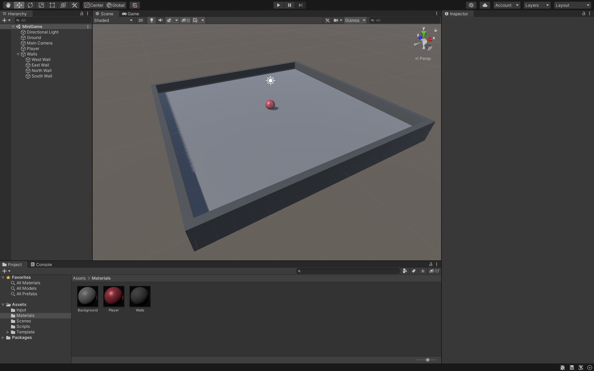
<p align="center">This is how your four walls look like</p>

# 5. Creating Collectibles
## Create a collectible GameObject
- Let's get started creating objects for the player to collect. 
- In the Hierarchy, select Add, 3D Object, Cube. 
- Rename the cube PickUp. 
- In the transform component, use the vertical ellipsis to reset the GameObject's transform to origin. 
- Press F to focus the scene view camera on the pickup cube. 
- The Player GameObject is currently overlapping the new cube so select the move tool and drag PickUp out of the way while you work on its functionality. 
- The cube is currently buried in the plane, just like the player sphere was when you started this project. Remember that? 
- The cube is also a regular shape, one by one by one. So let's lift it up by half a unit so that it rests on top of the plane. 
- In the transform component for the pickup GameObject, set the position y-value to 0.5. 
- This cube will be the collectible object in the game. 
- To be effective, it needs to attract the attention of the player so let's make the cube visually interesting. How about making it smaller? 
- In the transform component, set each of the scale axis values to 0.5. This will give it the effect of floating above the play area. That will help identify this object as special. But perhaps that's not enough. 
- Let's tilt it too. Set each of the rotation axis values to 45. 
- The cube also needs to stand out more against the background walls and the Player GameObject. Let's change its color by creating another material. 
- In the Project window, find and select your first material, background. 
- In the top menu, go to Edit > Duplicate. 
- Rename the new material PickUp. 
- With the PickUp material still selected in the Project window, use the color picker in the Inspector to change its base map color property. 
- Let's make it yellow and use the RGB values 255, 200, and zero. 
- Now you can change the color of the PickUp GameObject by changing its material on the Mesh Renderer component or by dragging the material from the Project window onto the cube in the Scene view. 
- Now it's starting to look more like a pickup, but it's still very static. 
- One thing that attracts attention of a user is movement. 
- In the next section, you'll write a script to rotate the cube.

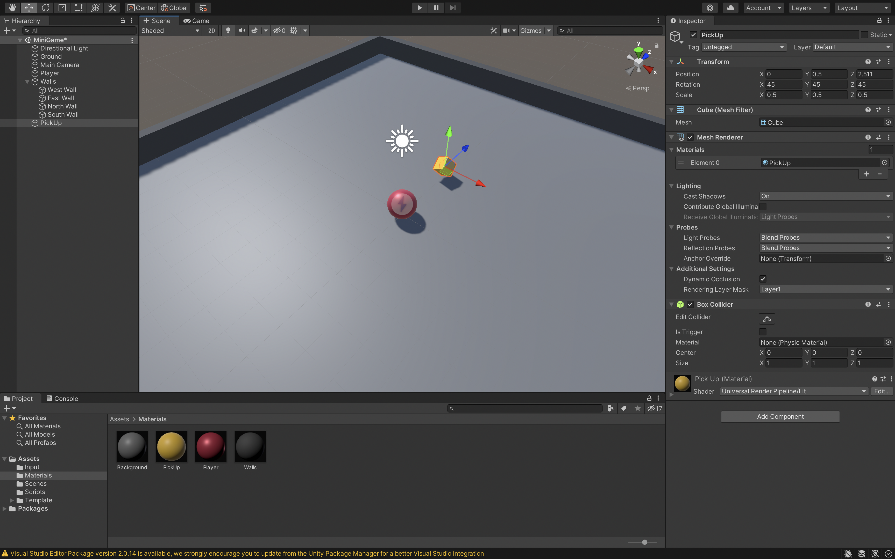
<p align="center">This is how your PickUp object should look like</p>

## Rotate the PickUp GameObject
- Okay, let's get that cube rotating. 
- As you've done before, select the PickUp GameObject in the hierarchy and then select Add Component, then, New script in the Inspector. 
- Call the new script Rotator, then, select Create and Add to confirm. 
- In the Project window, move the Rotator script to your Scripts folder to keep things organized, and then, open the script to edit it. 
- Once it's opened in your script editor, remove the Start function from the template. 
- You won't be using forces to rotate the cube, so you can use Update rather than using the Fixed Update function. So the rest is fine. 
- Now, before you begin, let's think for a moment about what this script needs to do. It needs to make the PickUp GameObject spin while the game is active. You have already set up the PickUp GameObject's transform rotation property to 45, 45 and 45 for the X, Y and Z axes. But these values don't change by themselves, and for the cube to spin, these values need to change every frame. To do this, you need to write a script that rotates the GameObject's transform. 
- There are two main ways to affect the transform of a GameObject. These are Translate and Rotate.
- Translate moves the GameObject by its transform. 
- Rotate rotates the GameObject by its transform. 
- It has two possible initial parameters, one using a Vector3 variable and the other using three float values for X, Y and Z. The simplest option is the Vector3 parameter, which is all that's needed for this game. 
- After the opening curly brace of the update function, add the following line of code:
```C#
public class Rotator : MonoBehaviour
{
    // Update is called once per frame
    void Update()
    {
        // Rotate the game object that this script is attached to by 15 in the X axis,
        // 30 in the Y axis and 45 in the Z axis, multiplied by deltaTime in order to make it per second
        // rather than per frame.
        transform.Rotate(new Vector3(15, 30, 45) * Time.deltaTime);
    }
}
```

- Make sure that transform is a lowercase T, because you're referring to the component not the variable type. 
- This action also needs to be smooth and frame rate independent. To do this, multiply the Vector3 value by time.deltaTime, before the closing parenthesis.
- "deltaTime" is perfect for ensuring actions happen smoothly, because deltaTime is a float representing the difference in seconds since the last frame update occurred. It will dynamically change its value based on the length of a frame. 
- Okay, that's all you need. 
- Save this script and return to Unity. 
- Let's enter play mode and test the script. 
- Excellent, the PickUp GameObject rotates. 
- Exit play mode when you're done testing. 
- Remember to save your Unity project frequently. Now's a great time to do that. 
- Now you've made a beautifully rotating collective object, but there's only one. 
- In the next section, you'll learn how to turn the PickUp GameObject into a prefab and add lots of collectable objects to the play area.

## Make PickUp a Prefab
- Now you've created one rotating pickup collectible, it's time to place them around the play area. There's one vital step needed to do this. You need to make the pickup GameObject into a prefab. 
- A prefab is an asset that contains a template, or a blueprint, of a GameObject or GameObject's family. 
- Once a GameObject is turned into a prefab, you can use the prefab in any scene in your current project. 
- By turning the pickup GameObject into a prefab, you will be able to make changes to a single instance of the prefab or to the prefab asset itself. And all of the pickup GameObjects in the game will be updated with those changes. 
- So let's get started. 
- First, go into the project window and check that you're at the root, or top level, of the project. 
- Make sure that no other item or directory is highlighted. Select Create > Folder, and rename this folder Prefabs. 
- Now, select the pickup GameObject in the Hierarchy and drag it into the Prefabs folder. 
- When you drag an item from the Hierarchy into the Project window, Unity creates a new prefab asset containing a template, or a blueprint, of the GameObject, or GameObject family. 
- Your GameObject will turn blue in the Hierarchy when it becomes a prefab instance. 
- Select the arrow to the right of the pickup prefab in the Hierarchy to open the Prefab Edit mode. From this mode, you can use the arrow at the top of the Hierarchy to return to a normal scene view. 
- Now you've turned the pickup GameObject into a prefab. 
- In the next section, you'll instantiate it around the play area for your players to collect.

## Add more collectibles
- Okay, let's fill the play area with rotating pickup objects. 
- Before you start, let's get things organized. 
- In the Hierarchy, create a new GameObject and call it "PickUp Parent". 
- In the Inspector, right-click the Transform component title and select Reset to reset pickup parent to origin. 
- Then, in the Hierarchy, drag the pickup GameObject onto pickup parent. 
- Next, make sure that you have the child pickup GameObject selected in Hierarchy, not the parent. 
- Select the gizmo in the upper right of the scene view to switch to a top down view. 
- Now use your scroll wheel to zoom out a little so you can see the entire play area. 
- Okay, let's start placing pickup objects. 
- Move the first pickup GameObject somewhere you like. 
- Next, let's duplicate the GameObject. 
- Make sure it's selected, and then go to Edit > Duplicate. 
- You can use the hot keys control-D for Windows or command-D for Mac OS. 
- Now place the second instance of the prefab. 
- Using the hot keys, create some more pickup GameObjects and place them around the play area. 
- About 12 is a good number for this game. 
- To make this easier, you can move parallel to the ground or XZ plane by selecting the XZ plane at the center of the gizmo. 

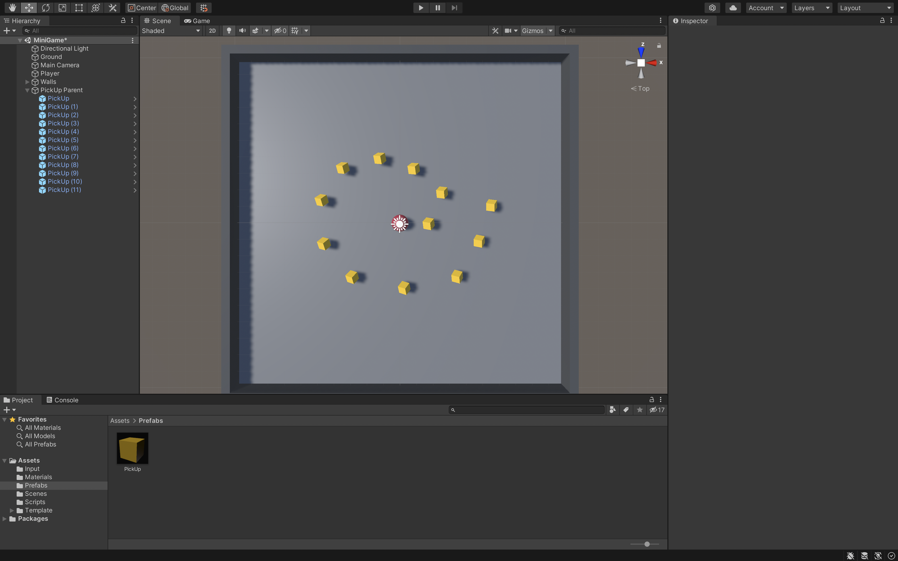
<p align="center">This is how your project should look like at this point (discard the position of objects, choose your own!)</p>

- At the moment, the collectible objects are present in the game. But the player can't actually collect them. That functionality is the next thing you're going to add.

# 6. Detecting Collisions with Collectibles
## Disable PickUps with OnTriggerEnter
- Okay, what's next? 
- Well, your players need to be able to collect the pickup GameObjects when the player GameObject collides with them. For this to happen, the game needs to detect the collisions between the player GameObject and the pickup GameObjects and use this information to trigger a new behavior. It's really important to test the collisions carefully. The pickup objects, the player's sphere, the ground plane, and the walls, all have colliders. Without testing, the player might be able to collect and disable the wrong objects in the scene. For example, the ground plane. 
- Let's get started. 
- In the Project window, go to the Scripts folder and open the Player Controller script for editing. 
- Before you begin writing the script, let's think about what the code needs to do. It needs to detect and test collisions on the player's sphere collider. To do this, you're going to use the function OnTriggerEnter. 
- Imagine that you're playing a platform game, and you jump up to collect a perfect arch of coins, but bounce off every first one and fall back to the ground. That's not very elegant. 
- The OnTrigger function will detect the contact between the player GameObject and the pickup GameObjects without actually creating a physical collision. 
- Let's start with the function declaration and parameters. 
- Beneath the FixedUpdate function write:
```C#
private void OnTriggerEnter(Collider other)
{
        
}
```

- OnTriggerEnter will be called by Unity when the player GameObject first touches a trigger collider. It will be given a reference to the trigger collider that has been touched. This is the collider called ˜other˜. 
- This reference gives you a way to identify the colliders that the sphere hits. 
- You could destroy the GameObject that the trigger collider is attached to. However, in case you want to add additional functionality to the collectable objects later on, in this project, you will only deactivate the GameObject rather than destroy it. 
- So how can you deactivate the correct object, and in this case, the pickup GameObjects using a script?
- Let's start to write the first line of code inside the function body for OnTriggerEnter. 
- You can address the other colliders GameObject through other.gameObject. To disable it, you need to use the method SetActive. This method accepts a boolean value inside the parentheses. That is true or false. Use false to disable the GameObject. 
- The full line should be:
```C#
private void OnTriggerEnter(Collider other)
{
    other.gameObject.SetActive(false);
}
```

- This code will disable GameObjects correctly. But you don't have a way to filter which GameObjects this sphere can disable. 
- In the next section, you'll use the Unity tag system to do just that.

## Add a tag to the PickUp Prefab
- Now, you've written code to deactivate GameObjects that they player GameObject collides with, but this should only apply to the pickup GameObjects. The ground or walls disappearing would not be good. 
- To do this, you're going to use the built-in Unity Tag System. 
- Tags allow you to identify a GameObject by comparing the tag value to a string. 
- The first thing we need to do is set up the tag value for the pickup objects back in the Unity Editor. 
- In the Project window, go to the Prefabs folder and select the pickup prefab. 
- You can also use the arrow next to one of the prefab instances in the Hierarchy. This opens prefab edit mode. 
- In the tag list at the top of the Inspector, there's a few pre-made tags, but there's nothing called pickup. 
- Select Add Tag. This brings up the tags and layers panel with a list that's currently empty. 
- To create a new custom tag, select the Add button to add a new row to the tag list. 
- In the new empty element, which will be tag zero, type PickUp. This is case sensitive so be careful. It needs to be exactly the same string that you use in the script. 
- You can close the tags and layers panel when you're done. 
- Now you need to apply that tag to the prefab asset. Select the tag dropdown again. 
- You should see that your new tag is now available in the list. 
- Select this tag from the list. 
- The asset is now tagged PickUp. 
- Use the arrow to leave prefab edit mode, and with the power of prefab, all the instances are also now tagged PickUp as well. 

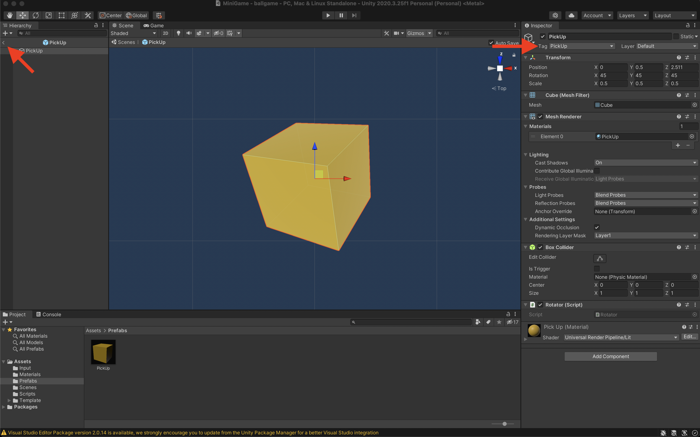
<p align="center">Insert the tag and leave the prefab edit mode</p>

- Great! 
- Save your changes in the Unity Editor before you return to the script. 
- In the next section, you'll use this tag to make sure the sphere can only disable GameObjects with the PickUp tag.

## Built With
- Unity
- Visual Studio
- C#

## Future Updates
- [x] ~~Include "Setting up the Game" section~~
- [x] ~~Include "Moving the Player" section~~
- [x] ~~Include "Moving the Camera" section~~
- [x] ~~Include "Setting up the Play Area" section~~
- [x] ~~Include "Creating Collectibles" section~~
- [ ] Include "Detecting Collisions with Collectibles" section - ***in progress***
- [ ] Include "Displaying Score and Text" section
- [ ] Include "Building the Game" section
- [ ] Update "Setting up the Game" sub-section with video transcript
- [ ] Update "Moving the Player" section before "Apply force to the Player" sub-section with video transcript

## Author
**Matheus Magnusson**
[Profile](https://github.com/mathmagson "Matheus Magnusson")

## Credits
**Unity Learn Platform**
[Website](https://learn.unity.com "Unity Learn Platform")

## 🤝 Support
Contributions, issues, and feature requests are welcome!

Give a ⭐️ if you like this project!